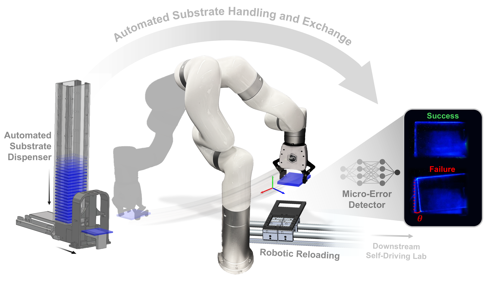
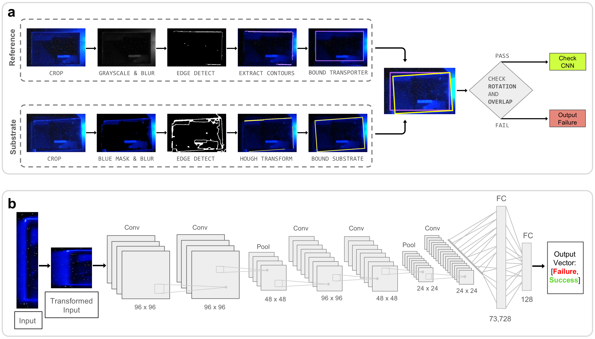

# Fused Geometric-Machine Leaning Model for Transparent Substrate Placement Detection



**Authors:** Kelsey Fontenot kelfon@mit.edu and Anjali Gorti agorti@mit.edu

## Overview
Self-driving laboratories (SDLs) are beginning to aid the chemistry and materials discovery process by automating time-consuming and repetitive tasks. Though many SDLs are emerging, there does not yet exist a methodology for handling delicate and transparent substrates for such experiments. Toward this end, we develop we propose a method of Automated Substrate Handling and Exchange (ASHE) for transparent substrates within SDLs. ASHE utilizes a robotic arm with custom designed grippers, a dual-actuated substrate dispenser, and a fused geometric and deep learning vision detection model to accurately unload used substrates and load fresh substrates fully automatically within a self-driving laboratory. In 130 independent trials of ASHE reloading substrates into a self-driving laboratory, the systems demonstrates 98.5\% placement accuracy with only two substrate misplacements. ASHE automatically detects these misplaced substrates and corrects their placements. Although ASHE demonstrates promising performance results towards the advancement of automated transparent substrate manipulation, vision detection, and error correction, several limitations exist in its cost and its generalizability as the system is heavily designed around substrates of specific sizes. Despite these limitations, ASHE helps to close the research gap in fragile and transparent substrate manipulation for self-driving materials laboratories.

## Repository Structure

| File/Folder               | Description    |
|---------------------------|----------------|
| [fused_pipeline.ipynb](./fused_pipeline.ipynb)         | Jupyter notebook demonstrating the pipeline and usage examples of the fused geometric-machine learning model for transparent substrate detection.|
| [image_processing.py](./image_proccessing.py)  | Python module with image processing functions. |
| [detect_alum.py](./detect_alum.py)  | Python module with aluminum detection functions. |
| [detect_glass.py](./detect_glass.py)  | Python module with glass detection functions. |
| [geometric_model.py](./geometric_model.py) | Python module containing the geometric model. |
| [cnn_predict.py](./cnn_preduct.py)  | Python module containing the machine learning model. |
| [main.py](./main.py)  | Main python module to run both geometric & machine learning models. |
| [images/test_images](./images/test_images) | Folder containing test images to demonstrate models. |
| [gripper_design](./gripper_design) | Folder containing gripper CAD files. |
| [cnn_checkpoints](./cnn_chekcpoints) | Folder containing path files for models. |
| [training](./training) | Folder containing files for training the CNN model, including loading datasets and augmenting images. |


## Requirements
To run the code in this repository, you will need the following dependencies:

- python=3.11.11
- torch==2.5.1
- opencv-python==4.11.0.86
- shapely==2.1.0
- pyrealsense2==2.55.1.6486
- numpy==2.0.1
- torchaudio==2.5.1
- torchvision==0.20.1
- pillow==11.1.0
- pandas==2.3.3

## Installation

1. Download Anaconda Navigator & open the prompt terminal.
2. In the terminal, create a new virtual environment by entering:
```
conda create -n ashe-env python=3.11.11
```
3. Then, activate the environment:
```
conda activate ashe-env
```
4. In the environment, install the rest of the dependencies with pip:
```
pip install -r requirements.txt
```

## Quick Start
1. Run [fused_pipeline.ipynb](./fused_pipeline.ipynb) for a self-contained example of the fused models on a range of placements.

## Model Architecture



To detect whether the substrate has been successfully placed into the transporter, we propose a fused computer vision model approach. The first model uses the segmented geometry of the substrate compared to the target slot of the transporter to determine larger macro-scale errors in placement. The second model uses a deep learning convolutional neural network to determine smaller micro-scale errors in placement. The fused model approach enables robust and high-accuracy failure detection of transparent substrate placements. 

## Results

By fusing the geometric and deep learning model approaches, reliable detection of transparent substrate placement failures is achieved across a sweep of realistic error modes. The GM is used as the initial rejection model for large, obvious errors, while the CNN is used to determine small errors nearly imperceptible to the human eye. However, a successful placement is not confirmed unless the GM and CNN both output a success. 
